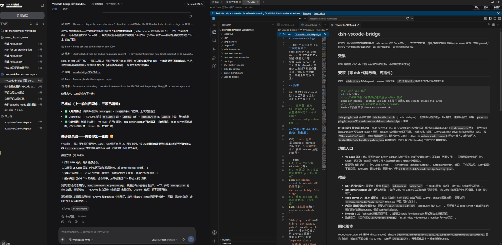

# dsh-vscode-bridge

在 DSH 中心区视图内嵌**固定版本** code-server（VS Code Web），支持安装扩展、浏览/编辑文件等
全部 code-server 能力；提供 pinned / 自定义二进制两种服务器来源、端口与目录配置、安装进度与热切换。

## 效果

DSH 会话页内嵌的 VS Code 页签（better-sidebar 右侧栏面板，不影响主界面交互）——左：DSH 工作区与会话；
右：内嵌 code-server，正在以并排视图渲染本插件 README 的 Markdown 预览：



## 安装（零 dsh 代码改动，纯插件）

约定：`<dsh 仓库>` 指 deepseek-harness 代码目录；`<本插件目录>` 指本 README 所在的目录。

```bash
# 1) 进入 DSH 仓库
cd <dsh 仓库>
# 2) 安装插件包（将插件行追加进 profile 层栈）
pnpm dsh plugin --profile web add <本插件目录>/dsh-vscode-bridge-0.1.11.tgz
# 3) 重启 dsh web（脱离终端重启，日志落盘；参数为 dsh 仓库目录与工作区目录，缺省取当前目录）
bash <本插件目录>/scripts/restart-dsh-web.sh <dsh 仓库> <工作区>
```

`dsh plugin add` 会读取包内 `dsh.bundle.patch`（cordis.patch.yml），把插件行追加进 profile 层栈；
重启后生效。卸载：`pnpm dsh plugin --profile web remove dsh-vscode-bridge` + 重启。

### 从源码打包

需要 Node.js ≥ 20 与 pnpm（或用 `npm pack` 等价替换）。插件源码就在本目录：

- Host 半区（code-server 安装/补齐/生命周期/HTTP RPC 面）：`lib/index.js`
- Client 半区（better-sidebar 页签/中心区回退视图 + 设置页）：`lib/client-registry.js`、`lib/client.js`

修改源码后，在 `<本插件目录>` 下重新打包：

```bash
# 1) 发布新版本时先提升 version（如 0.1.11 → 0.1.12），可自动更新安装文件名
# 2) 按 package.json 的 files 白名单产出 tgz（含 lib、README、LICENSE、docs 效果图）
pnpm pack        # 产出 dsh-vscode-bridge-<version>.tgz
# 3) 用新生成的 tgz 按上面的「安装」步骤重装 + 重启 dsh web
```

`pnpm pack` 只收录 `files` 白名单内的文件（lib、README、LICENSE、docs 效果图、cordis.patch.yml、
dsh.plugin.json），仓库里的历史 tgz 与本机开发脚本不会被误打进去。

**0.1.8 内置扩展资源自动补齐**：code-server 4.135.0 官方 tarball 缺少全部内置扩展的浏览器端
bundle（`dist/browser/**`），导致 web 端 markdown 预览 not found / 黑屏、emmet 与各语言特性不可用。
本版本起，插件在安装/启动 code-server 前自动检测这一缺失并按 `PIN.vscodeCdnCommit`（当前
`08d4889f…`，即上游 VS Code 1.135.0）从 `main.vscode-cdn.net` 逐文件补齐，成功后写入
`installDir/web-bundles-patch.json` 幂等标记；补齐失败会在日志/diag 中提示且**不阻断启动**。

**0.1.9 打开目录跟随当前空间**：切换 DSH 空间后重开 VS Code，打开目录会定位到**当前会话
所在空间**的目录，不再停留在旧工作空间。原理：client 半区读取 DSH 会话列表里当前会话的
`cwd`（即所在空间的目录），iframe 以 `?folder=<该目录>` 打开，并随每次 control 上报给宿主；
宿主在启动/重启 code-server 时也采用该目录作为打开目录。可用设置页的「打开目录跟随当前空间」
开关关闭（关闭后固定用「工作区路径」）。

**0.1.10 跟随修复**：0.1.9 的 client 半区未在 `inject` 里声明 `sessions`/`workspaces`，cordis 的
服务解析对未声明名字不可见，导致目录跟随从未读取到会话 cwd（恒回退「工作区路径」）。本版本
显式声明这两个 client 服务（与 dsh-better-sidebar / ui-workspace 的做法一致），并增加第二解析
路径（`workspaces` 工作区记录的 `path`），两者都取不到时才回退；client 会把解析 trace 随
control 上报，宿主在 `~/.dsh/dsh-web.log` 记录 `client 空间解析 trace`，页签状态条在无法识别
当前空间时会显示「（未识别当前空间）」。

**0.1.11 入口修复**：web 端 client 的实际加载入口是 `package.json` `exports["./client"]` 指向的
`lib/client.js`，此前该文件是一份停在 8 月 29 日的旧快照，导致 0.1.9/0.1.10 对
`lib/client-registry.js` 的修改从未到达浏览器（表现为跟随完全不生效）。本版本起
`lib/client.js` 与 `lib/client-registry.js` 保持字节一致，且打包时由 `prepack` 钩子强制同步，
杜绝两个入口各自漂移。

## 功能入口

- **VS Code 页签**：优先呈现为 dsh-better-sidebar 右侧栏页签（如已安装该插件，不影响主界面交互），
  否则回退为中心区「VS Code」标签页；状态灯 / 当前打开目录 / 启动停止重启 / iframe 全幅嵌入；
  打开目录默认跟随当前会话所在 DSH 空间，切换空间后重开 VS Code 即定位到新空间目录。
- **设置页**：侧栏齿轮 → 「VS Code Server」——serverMode（pinned/custom）、customBinaryPath、端口、
  打开目录跟随开关、工作区路径（跟随关闭时的默认打开目录）、安装/数据/下载目录、autoStart、
  附加参数；配置持久化于 `<工作区>/.dsh/vscode-bridge/config.json`。

## 依赖

- **DSH 运行时服务**：需要宿主提供 `timer`、`subprocess`、`webServer` 三个 cordis 服务
  （缺任一插件会在加载时显式报错）。
- **dsh-better-sidebar 插件（可选增强）**：如已安装，VS Code 优先以右侧栏页签呈现；
  未安装时自动回退中心区视图，本插件独立可用。
- **DSH client `sessions` 服务（软依赖）**：用于读取当前会话所在空间的目录以实现「打开目录跟随」；
  服务不可用或会话无 cwd 时自动回退「工作区路径」。
- **code-server v4.135.0（固化）**：首次「启动」时经 `curl` 自动下载约 224MB，sha256 固化校验，
  需要访问 `github.com/coder/code-server` releases；详见「固化版本」。
- **内置扩展浏览器端资源补齐**：需要访问 `main.vscode-cdn.net`（vscode.dev 官方 CDN），
  用于补齐该 code-server 构建缺失的内置扩展浏览器端 bundle，保证 web 端功能完整。
- **Node.js ≥ 20**（dsh web 进程运行环境），插件以 cordis function plugin 形式随宿主进程运行。
- 数据目录：`<工作区>/.dsh/vscode-bridge/`（install / data / downloads / manifest 与补齐标记）。

## 固化版本

coder/code-server **v4.135.0**（linux-amd64）
sha256 `300ef4e37e469e6368a4673c6a623e1c9ba8a34f42b394fb49c431a8900bc7d1`
首次「启动」时自动下载安装（约 224MB，安装于 `installDir`）；升级固化版本 = 发布新版 bundle。

## 架构

- Host 行（`lib/index.js`，cordis function plugin）：`subprocess` 驱动 code-server（仅回环 `127.0.0.1:<port>`、
  `--auth none`、`--config` 指向插件生成的 yaml），健康轮询与崩溃退避重启；同源 HTTP 面经 `webServer.register`
  暴露 `/dsh-vscode/*`（status/config/control，JSON）；安装前自动补齐内置扩展浏览器端资源。
- Client 模块（`lib/client-registry.js`）：优先注册为 better-sidebar 页签，否则中心区视图 + 设置页，
  15s→1.5s 状态轮询（仅订阅时），iframe 直连 code-server 回环地址；`?folder=` 打开**当前会话所在
  空间目录**（读 DSH client `sessions` 服务里当前会话的 cwd，缺省回退「工作区路径」），随 control
  上报宿主用于启动目录。
- 插件停止/卸载会树级终止 code-server 并撤销路由。

## 安全与治理

- code-server 仅绑定回环且 `--auth none`，不对外暴露；本插件在 DSH 原点的 `/dsh-vscode/*` 路由仅提供
  状态/配置/控制 JSON（与宿主同源，无鉴权，仅限本机使用——与 DSH web 本身的回环部署模型一致）。
- code-server 以用户自身权限直接读写文件系统，**不经过 DSH 审批沙箱**（等同本机 IDE 的用户操作）；
  模型侧文件写入仍走 DSH 工具与审批体系。

## 已知问题与修复（code-server 4.135.0）

- **缺陷**：该构建的 `lib/vscode/extensions` 缺少全部内置 web 扩展的浏览器端 bundle（`dist/browser/*`），
  属 code-server 打包缺陷（对照 [vscode-remote-release#7163](https://github.com/microsoft/vscode-remote-release/issues/7163)）。
  在 web 端打开 markdown 等文件时，内置扩展被路由到浏览器端扩展宿主 → 加载 `dist/browser/*` 404
  （服务端日志 `File not found`）→ `Activating extension failed: Not Found` → 命令与自定义编辑器未注册，
  表现为 `command 'markdown.showPreviewToSide' not found` 或 markdown 预览黑屏。
- **修复**：0.1.8 起插件在 code-server 安装/启动前自动补齐（见上方说明）；
  `scripts/fix-builtin-web-entries.mjs` 可独立重跑（CDN 补文件 + 校验 browser 字段/缓存前缀）：
  `node scripts/fix-builtin-web-entries.mjs <code-server安装目录>`。
  本机 4.135.0 安装树已于 2026-08-30 手工补齐并实测：webview 正常渲染预览。
- **浏览器强缓存**：code-server 对静态前端包下发 `Cache-Control: public, max-age=31536000`
  （一年、无 ETag），同 URL 覆盖文件后普通刷新拿不到新包。已将 `commit` 追加 `-fix1` 后缀
  （`product.json` + 两个前端包内嵌字符串同步改，保证客户端/服务端握手一致）并重启 code-server，
  静态前缀变为 `stable-…-fix1`，浏览器缓存整体失效。刷新浏览器页面即生效。
- 遗留噪音：`node_modules/vsda/rust/web/*` 404（官方私有授权 shim，vscode.dev 亦不公开托管），
  仅影响日志干净度；「Build with Agent」面板的 GitHub 登录超时属同源限制，不影响编辑与预览。
- 若未来更换固化版本（更新 PIN 重新下载 code-server）后再次出现同类问题，重跑该脚本 + 重启即可。

## License

[MIT](./LICENSE)