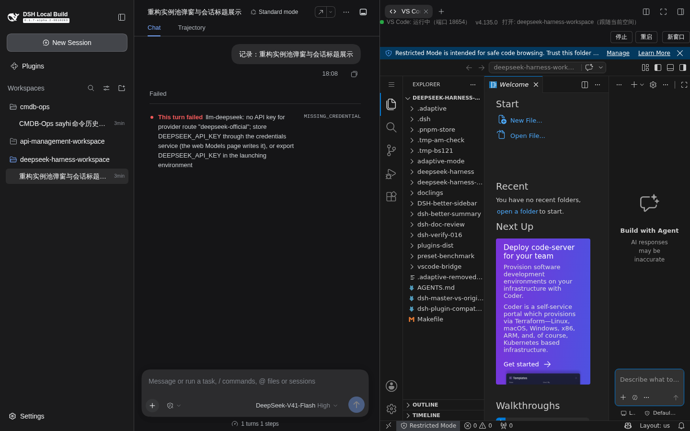
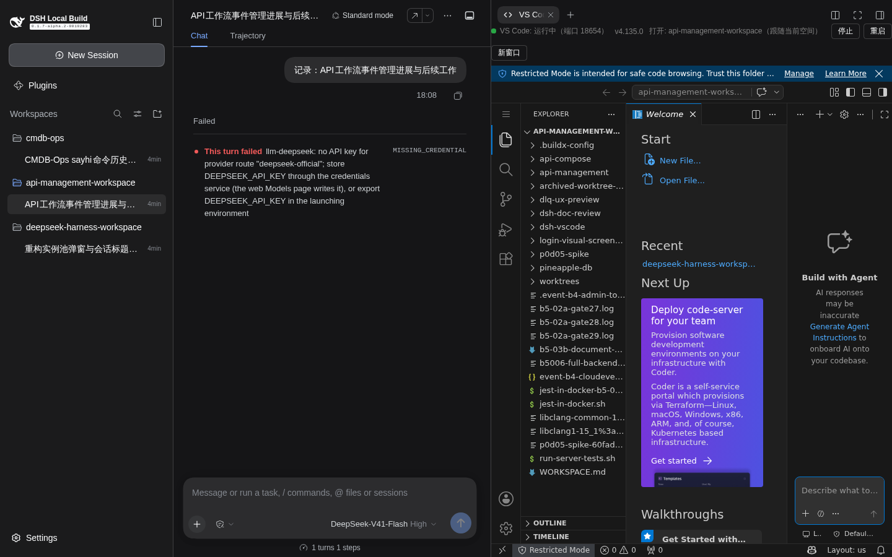
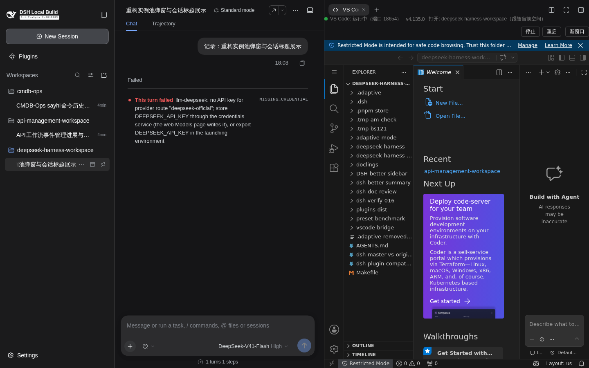
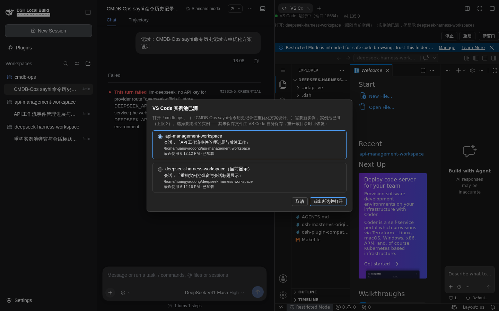
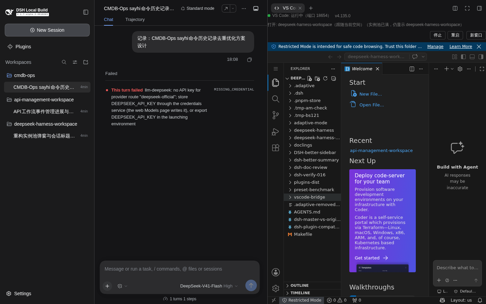
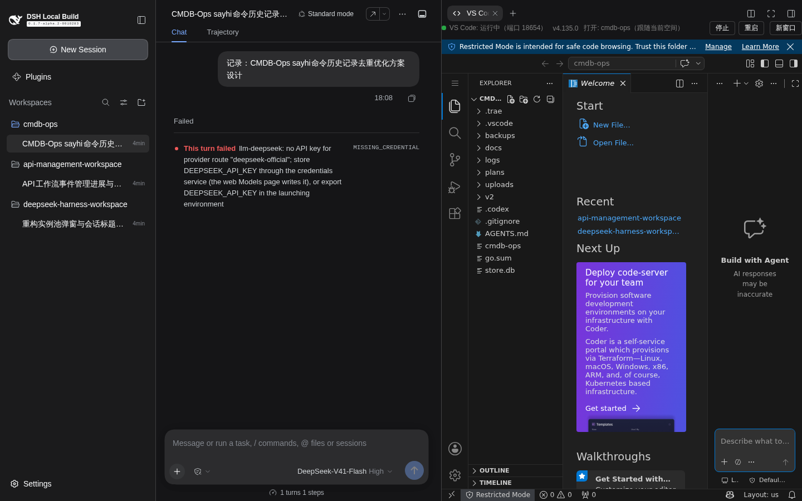
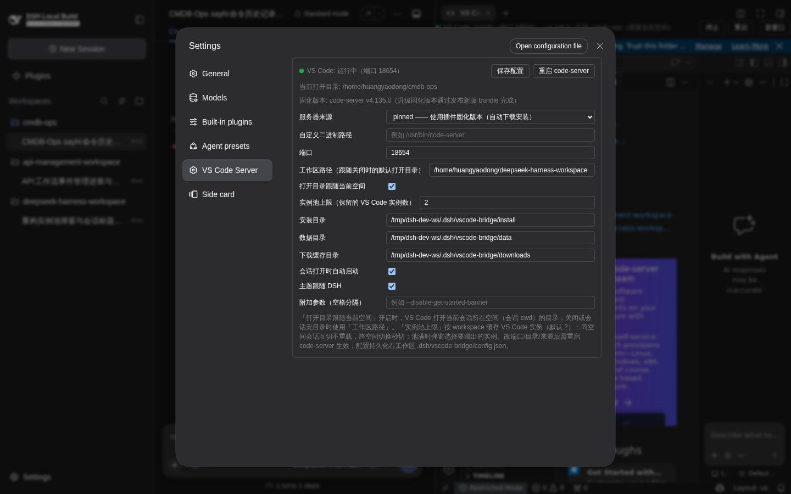

# dsh-vscode-bridge 0.1.20 e2e 验证报告 —— 实例池 + 弹窗会话标题

- **被测版本**：`dsh-vscode-bridge@0.1.20`（`feat/vscode-instance-pool` 分支，含 0.1.19 实例池与 0.1.20 弹窗会话标题）
- **验证环境**（按工作区规则 1，全程使用隔离调试实例，未触碰 3080 主实例）：
  - `DSH_HOME=/tmp/dsh-dev-home`（独立 home：profile / 会话 / 存储全部隔离）
  - `DSH_VSCODE_BRIDGE_WORKSPACE=/tmp/dsh-dev-ws`（独立插件数据区：config 18654 端口、独立 user-data）
  - `dsh web --no-open --port 3190`（独立端口），code-server 落在 18654
  - 同装 `dsh-better-sidebar@0.21.0`（对齐真实使用形态：VS Code 以右侧栏页签呈现）
- **驱动方式**：Playwright（真实浏览器）逐步驱动会话切换与页签开合，断言实例池状态、弹窗内容与重载行为；
  会话种子经宿主 RPC（`workspace.create` / `session.create` / `session.rename` / `session.prompt`）造出
  3 个空间 × 3 个带标题的会话。
- **结果**：**18/18 断言通过**（原始记录：[e2e-results-0.1.20.json](./e2e-results-0.1.20.json)）

## 种子数据（3 空间 × 3 会话）

| 空间 | 会话标题 |
| --- | --- |
| deepseek-harness-workspace | 重构实例池弹窗与会话标题展示 |
| api-management-workspace | API工作流事件管理进展与后续工作 |
| cmdb-ops | CMDB-Ops sayhi命令历史记录去重优化方案设计 |

## 验证点与现场证据

### 1. 打开 VS Code → 实例 1（空间 A）

断言：`iframe[title="VS Code"]` 计 1 个，`?folder=` 指向会话 A 所在空间（跟随当前空间生效）。
结果：**PASS**（frames=1，folder=deepseek-harness-workspace）

### 2. 切到另一空间的会话 → 池未满自动新建实例、不弹窗

断言：实例数 1→2，且无腾位弹窗。
结果：**PASS**（frames=2，modal=null）

### 3. 切回原空间 → 池内秒切（零重载）

断言：实例数不变；自本次切换起 `iframe` **无任何导航事件**（同一活实例原地复用，编辑器状态不丢）。
结果：**PASS**（frames=2，navs=0）

### 4. 第三个空间 → 池满弹窗（**带会话标题**，本轮重点）

断言：弹窗出现；列出 2 个可腾位实例；两个候选均带该空间的**会话标题**；描述行带**触发弹窗的会话标题**；
当前显示实例有「（当前显示）」标注；默认预选最近最少使用者。
结果：**PASS**（4/4 子断言）

实测弹窗文本（节选）：

> 打开「cmdb-ops」（**「CMDB-Ops sayhi命令历史记录去重优化方案设计」**）需要新实例，实例池已满（上限 2）。
> 选择要踢出的实例——其未保存文件由 VS Code 自身保存，重开该目录时可恢复：
> - api-management-workspace — **会话：「API工作流事件管理进展与后续工作」** · /home/…/api-management-workspace · 最近使用 6:12:12 PM · 已加载
> - deepseek-harness-workspace（当前显示）— **会话：「重构实例池弹窗与会话标题展示」** · /home/…/deepseek-harness-workspace · 最近使用 6:12:16 PM · 已加载

### 5. 「取消」→ 保持现状 + 状态条提示

断言：实例数不变、弹窗关闭、状态条出现「（实例池已满，仍显示 …）」提示（用户知道自己没切换）。
结果：**PASS**（frames=2，modal=null，bar 含提示）

### 6. 切走再切回 → 重新弹窗 → 「踢出所选并打开」

断言：切走再回到该空间会重新弹窗（取消只抑制当前这一次请求）；确认后被踢实例销毁、新空间实例建立，
实例数恒等于上限 2。
结果：**PASS**（modal target=cmdb-ops；frames=2 含 cmdb-ops；被踢的 deepseek-harness 实例已从 DOM 移除）

### 7. 设置页「实例池上限」

断言：设置页含「实例池上限（保留的 VS Code 实例数）」字段（默认 2，1–8）。
结果：**PASS**

## 断言清单（18/18）

| # | 验证点 | 结果 |
| --- | --- | --- |
| 1 | 打开 VS Code 产生 1 个实例 | PASS |
| 1 | 实例 folder = 会话 A 所在空间 | PASS |
| 2 | 跨空间自动新建实例（池未满） | PASS |
| 2 | 池未满不弹窗 | PASS |
| 3 | 切回原空间实例数不变 | PASS |
| 3 | 池内秒切零重载（navs=0） | PASS |
| 4 | 池满弹窗出现 | PASS |
| 4 | 弹窗列出 2 个可腾位实例 | PASS |
| 4 | 候选含空间 A 的会话标题 | PASS |
| 4 | 候选含空间 B 的会话标题 | PASS |
| 4 | 描述行含触发会话标题 | PASS |
| 5 | 取消后实例数不变 | PASS |
| 5 | 取消后弹窗关闭 | PASS |
| 5 | 状态条提示未跟随 | PASS |
| 6 | 切回后重新弹窗 | PASS |
| 6 | 腾位后实例数恒为上限 | PASS |
| 6 | 新空间实例已建立 | PASS |
| 7 | 设置页含「实例池上限」字段 | PASS |

## 说明

- 本页签内的会话切换、弹窗交互、实例生命周期均为**真实浏览器行为**；仅种子数据经宿主 RPC 造出
  （并附带一条消息使会话非空、可显示标题）。
- 调试实例无模型凭据，种子会话的首轮对话报 `MISSING_CREDENTIAL`（不影响本验证）；首次进入会弹
  「Add an API key」引导，e2e 统一关闭后再交互。
- 3080 主实例本轮**未安装**该版本（按规则 1：主实例待用户确认后更新）。
