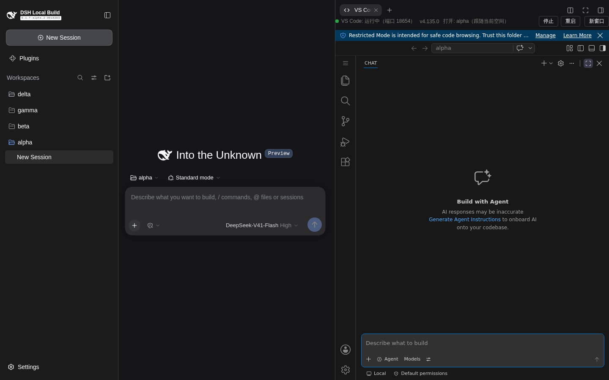
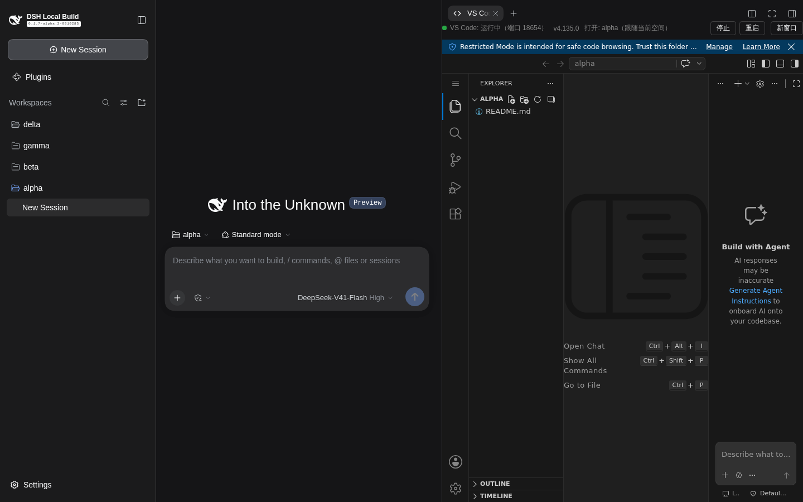
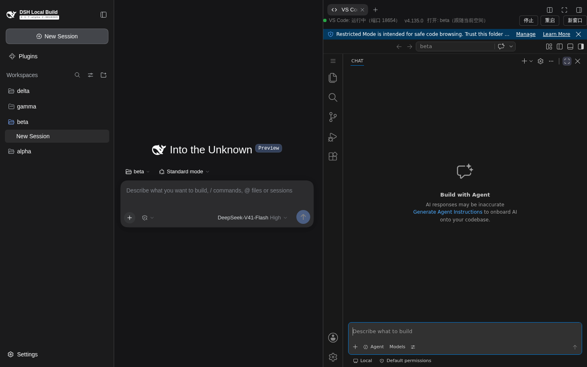
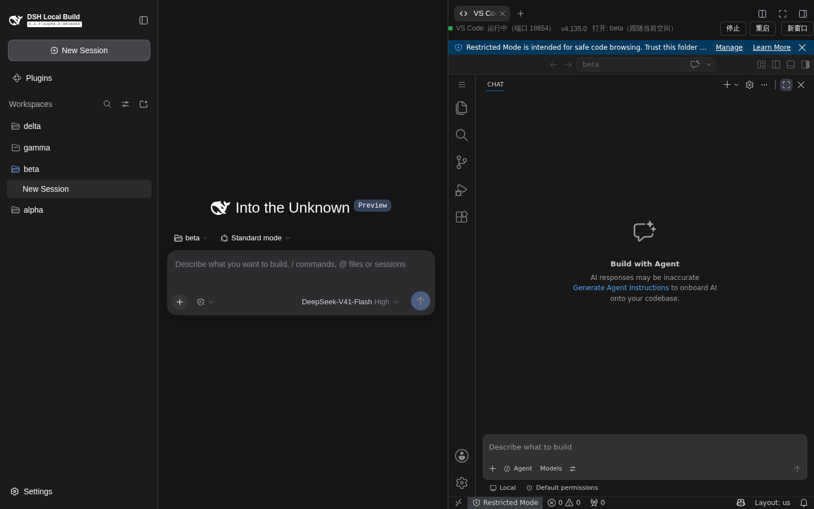
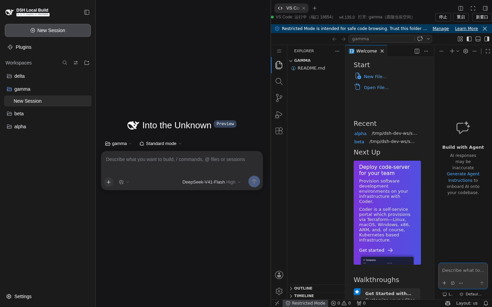
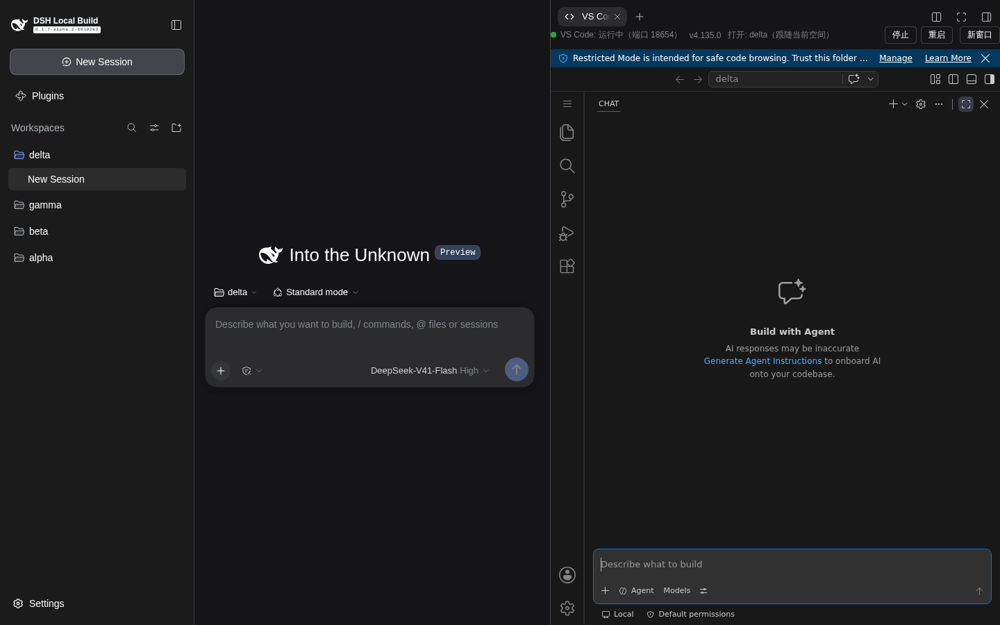
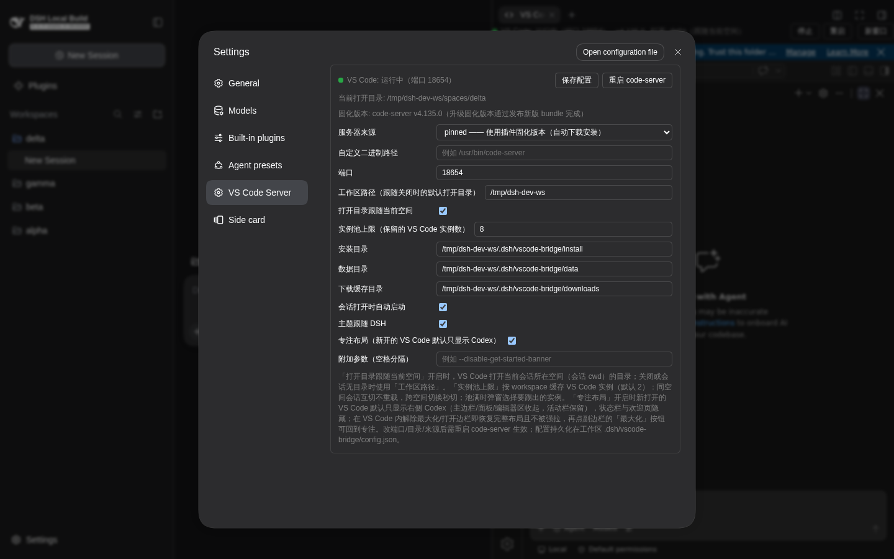

# dsh-vscode-bridge 0.1.21 e2e 验证报告 —— 专注布局（新开的 VS Code 默认只显示 Codex）

- **被测版本**：`dsh-vscode-bridge@0.1.21`（`feat/focus-layout` 分支，基于 0.1.20 实例池）
- **验证环境**（按工作区规则 1，全程使用隔离调试实例，未触碰 3080 主实例与其 code-server 18644）：
  - `DSH_HOME=/tmp/dsh-dev-home`（独立 home：profile / 会话 / 存储全部隔离）
  - `DSH_VSCODE_BRIDGE_WORKSPACE=/tmp/dsh-dev-ws`（独立插件数据区：code-server 端口 18654、独立 user-data）
  - `dsh web --profile web --no-open --port 3190`；同装 `dsh-better-sidebar@0.21.0`（对齐真实使用形态）
  - code-server 安装树与已装扩展（openai.chatgpt / rust-analyzer）从主实例**只读复制**，避免重复下载
  - 测试空间：`/tmp/dsh-dev-ws/spaces/{alpha,beta,gamma,delta}` 四个全新目录（e2e 开头自动重置：
    停 code-server → 清 user-data → config 复位 focusLayout=true → ensure 启动）
- **驱动方式**：Playwright（真实浏览器）驱动会话切换、页签开合、iframe 内 workbench 布局探针
  （根容器类名 `nosidebar / nomaineditorarea / nopanel / noauxiliarybar / noactivitybar / nostatusbar`
  + 各 `.part.*` 实测几何 + settings.json 落盘内容三重断言）。
- **结果**：**20/20 断言通过**（原始记录：[e2e-results-0.1.21.json](./e2e-results-0.1.21.json)）

## 实现回顾

- 宿主（`lib/index.js`）：配置项 `focusLayout`（默认 true，持久化 config.json）+
  `POST /dsh-vscode/layout`（body `{focus: boolean}`，缺参 400）——写/删 code-server user settings.json 三键，
  幂等比较、tmp+rename 原子写、返回 `{ok, focus, changed}`：
  ```json
  { "workbench.secondarySideBar.defaultVisibility": "maximized",
    "workbench.statusBar.visible": false,
    "workbench.startupEditor": "none" }
  ```
- 客户端（`lib/client-registry.js`，prepack 同步 `lib/client.js`）：`pushLayout()` 与 pushTheme 同型；
  每次 iframe 启动前 `Promise.all([pushTheme, pushLayout])` 先落盘再启动；配置差值（设置页保存 /
  1.5s 状态轮询，含多页签他端）发现变化 → 推送 → 宿主 `changed=true` 才对池内全部已加载实例
  收敛重载（复用 0.1.16 收敛路径）；设置页新增「专注布局」勾选框。
- 语义决策（按用户拍板）：**活动栏不藏**（副边栏顶部 CHAT/CODEX 切换条随默认 location 保留）；
  **不引入** `forceMaximized`（避免"编辑器全关被拉回最大化"）；`defaultVisibility` 只对 workspace
  **首次打开**生效，此后布局由 VS Code 按 workspace 持久化接管——已退出专注的 folder 保持用户布局不被强拉。

## 验证点与现场证据

### 1. V1 全新空间（alpha）首开 → 专注布局

断言：主边栏/编辑器区/面板收起（`nosidebar/nomaineditorarea/nopanel` + 几何 0）、状态栏隐藏、
活动栏保留（48px）、副边栏占满 workbench（599 = workbench 647 − 活动栏 48）、三键落盘。
结果：**7/7 PASS**


副边栏默认容器为 CHAT（Codex 扩展的会话视图）；点一次 CODEX 标签即持久化（已知边界，见文末）：



### 2. V2 显式打开主边栏 → 解除最大化；重载后保留用户布局（决策点）

断言：点活动栏图标（显式用户动作）→ `setSideBarHidden(false)` 自动解除最大化、编辑器区还原；
**等 10s（web 端存储落盘）后经桥自身重载机制（dshreload）冷启动 → 用户布局保留**、状态栏仍隐藏
（settings 级键每次启动覆盖持久化值）。
结果：**3/3 PASS** —— "已打开的 VS Code 退出专注后保留当前布局" 成立，且跨重载成立。




### 3. V3 全新空间（beta）→ 新实例自动进专注

断言：池未满自动新建实例（共 2），beta 首开即专注。
结果：**PASS**



### 4. V4 关闭「专注布局」→ 收敛重载；gamma 全新空间不再自动最大化

断言：API 关开关（等价多页签他端改配置）→ 客户端轮询差值 → 收敛重载池内已加载实例：
alpha 状态栏**恢复**、**保留用户布局**（重载只套全局键、不强行改 workspace 布局）；
beta **保持专注**（其 `wasLastMaximized=true` 已按 workspace 持久化，开关不追溯已打开的 workspace）；
三键从 settings.json 移除；gamma 全新空间启动**不自动最大化**、状态栏可见。
结果：**6/6 PASS**





### 5. V5 重新开启 → delta 全新空间再次进专注

断言：三键重新落盘；delta 首开即专注。
结果：**2/2 PASS**



### 6. V6 设置页 UI 检查（只读）

断言：左栏 Settings → VS Code Server 区块存在「专注布局（新开的 VS Code 默认只显示 Codex）」
勾选框，勾选状态与配置一致（true）。
结果：**PASS**（只读，不写入，避免误触「重启 code-server」）



## 复跑方式

```bash
# 依赖 @playwright/test：仓库内做临时链接（跑完可删）
cd <本插件目录> && ln -sfn ../DSH-better-sidebar/node_modules node_modules
DSH_URL='http://127.0.0.1:3190/?token=<一次性启动 token>' node demo/e2e-focus-layout.mjs
# 隔离实例启动：
cd <dsh 仓库> && DSH_HOME=/tmp/dsh-dev-home DSH_VSCODE_BRIDGE_WORKSPACE=/tmp/dsh-dev-ws \
  node apps/cli/lib/bin.js --profile web --no-open --port 3190
```

## 已知边界（与 README 0.1.21 条目一致）

1. **本功能启用前已打开过的 folder 不会自动进专注**（`defaultVisibility` 仅首次打开生效）：
   在该 VS Code 里点一次副边栏标题栏的「最大化副边栏」按钮即持久化生效；解除/重进专注完全由用户控制。
2. 新 folder 首开时副边栏默认容器可能是 CHAT 而非 CODEX（VS Code 按贡献顺序选默认容器）：
   点一次 CODEX 标签即持久化。如需全自动，后续可加微型内置扩展执行 focus 命令（方案 B，本期不做）。
3. **紧贴重载的时间窗**：web 端布局状态经 IndexedDB/beforeunload 落盘——解除专注后立刻（<10s）
   重载该实例，最后一次布局变更可能未及落盘而被旧状态覆盖（与 vscode.dev 原生行为一致）；
   正常使用（操作与重载间隔数秒以上）不受影响，e2e 里以 10s 等待覆盖该语义。
4. settings.json 为 theme 与 layout 两个写入方共享：均为读改写 + 原子替换 + 启动前串行 await，
   实测无撕裂/互覆盖。