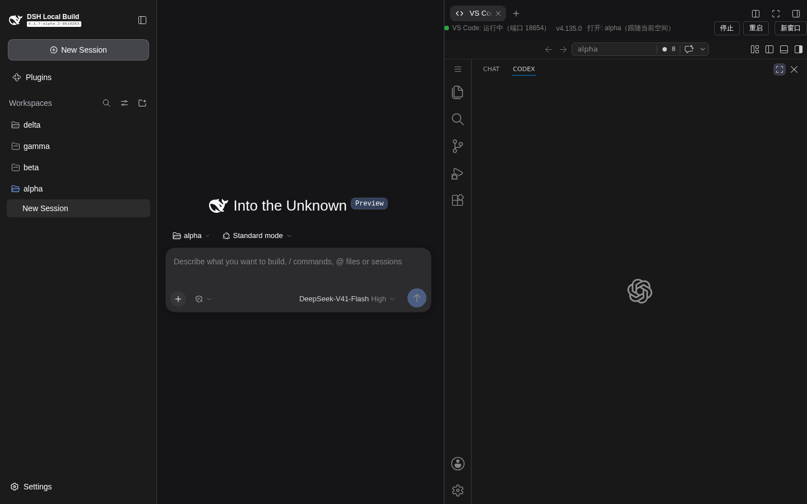

# dsh-vscode-bridge 0.1.23 e2e 验证报告 —— 副边栏默认定位到 Codex（专注布局 + 信任目录回归）

- **被测版本**：`dsh-vscode-bridge@0.1.23`（`feat/focus-layout` 分支；0.1.21 专注布局 + 0.1.22 信任目录之上，
  新增「新 workspace 首启副边栏自动定位到 Codex」）
- **验证环境**（按工作区规则 1，全程隔离调试实例，未触碰 3080 主实例与其 code-server 18644）：
  - `DSH_HOME=/tmp/dsh-dev-home`、`DSH_VSCODE_BRIDGE_WORKSPACE=/tmp/dsh-dev-ws`、
    `dsh web --profile web --no-open --port 3190`（code-server 18654）
  - 同装 `dsh-better-sidebar@0.21.0`；扩展含 `openai.chatgpt`（Codex）/ `rust-analyzer`（自主实例只读复制）
  - 测试空间 `/tmp/dsh-dev-ws/spaces/{alpha,beta,gamma,delta}`；e2e 开头自动重置（停 code-server →
    清 user-data → config 复位 focusLayout/trustWorkspace=true、池上限 8 → ensure 启动）
- **结果**：**24/24 断言通过**（原始记录：[e2e-results-0.1.23.json](./e2e-results-0.1.23.json)）

## 0.1.23 新增实现

**问题**：新 workspace 首启时副边栏默认容器是内置 Chat（GitHub agent 视图），Codex 装了也要手动点一次标签。

**做法**（宿主 `lib/index.js`）：
1. `findCodexAuxContainerId()`：扫插件托管的 extensions 目录各扩展 `package.json` 的
   `contributes.viewsContainers.secondarySidebar`，取 id/标题含 `codex` 的容器（实测命中 Codex 扩展的
   `codexSecondaryViewContainer`；找不到 codex 匹配时回退首个副边栏容器；未安装则返回 null）。
2. `ensureLayoutInitExtension()`：每次启动 code-server 前在 pinned 安装树的**内置扩展目录**生成/覆盖
   微型扩展 `dsh-layout-init`（node 侧 `main`，`onStartupFinished` 激活），目标命令
   `workbench.view.extension.codexSecondaryViewContainer` 随生成时烘焙。
3. 微扩展行为：容器命令存在（Codex 已安装）且**该 workspace 尚未定位过**（`workspaceState` 记账，
   每 workspace 仅一次）才执行一次定位命令；已定位过 → 不再执行，布局交给用户与 VS Code 持久化，
   **绝不重复执行/强拉**（与专注布局"不强拉"语义一致）。Codex 未安装 → 扩展静默空转；
   custom 二进制模式不改其安装树、暂不注入；Codex 安装/卸载后重启 code-server 使生成内容更新。

## 验证点与现场证据

| # | 验证点 | 结果 |
| --- | --- | --- |
| V1 | alpha 首开：专注布局全项（边栏/编辑器/面板收起、状态栏隐藏、活动栏保留、副边栏最大化）+ 无信任横幅 + 四键落盘 | 8/8 PASS |
| V1 | **副边栏默认定位到 Codex**：容器页签 `Chat\|Codex`，激活项 = **Codex**、标题 label = Codex | PASS |
| V2 | 显式打开主边栏 → 解除最大化；重载后保留用户布局；状态栏仍隐藏 | 3/3 PASS |
| V3 | 全新空间 beta 自动进专注 | PASS |
| V4 | 关闭专注：alpha 状态栏恢复且保留用户布局；beta 保持专注；focus 三键移除、trust 键保留 | 6/6 PASS |
| V4 | gamma 全新空间不自动最大化、状态栏可见，且**副边栏同样定位到 Codex（首启一次，专注关闭时也生效）** | PASS |
| V5 | 重新开启：delta 再进专注、四键重新落盘、**副边栏定位到 Codex** | 3/3 PASS |
| V6 | 设置页「专注布局」勾选框存在且状态一致（只读检查） | PASS |

首开即定位到 Codex（无横幅、无杂物，OpenAI Codex 视图加载态）：



## 复跑方式

```bash
cd <本插件目录> && ln -sfn ../DSH-better-sidebar/node_modules node_modules
DSH_URL='http://127.0.0.1:3190/?token=<一次性启动 token>' node demo/e2e-focus-layout.mjs
# 隔离实例启动：
cd <dsh 仓库> && DSH_HOME=/tmp/dsh-dev-home DSH_VSCODE_BRIDGE_WORKSPACE=/tmp/dsh-dev-ws \
  node apps/cli/lib/bin.js --profile web --no-open --port 3190
```

## 说明与边界

- 0.1.21（专注布局）/0.1.22（信任目录）的验证记录：[e2e-report-0.1.21.md](./e2e-report-0.1.21.md)、
  [e2e-report-0.1.22.md](./e2e-report-0.1.22.md)；本轮 01–09 截图为 0.1.23 重跑产物（覆盖同名文件）。
- 定位为「每 workspace 一次」：用户此后切到别的容器/关掉副边栏，重启/重载都不会被拉回——
  与"已退出专注则保留用户布局"同一控制权语义。
- 生成物写入的是 pinned 安装树内置扩展目录（本插件管理并已在补齐流程中验证过可写）；
  更换固化版本（PIN 升级）后会随新安装树重新生成。